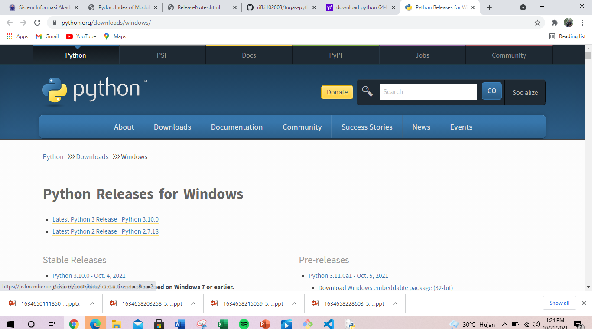

# tugas-python
## Belajar Python

### Tutorial cara menggunakan Python
Berikut langkah - langkah nya.

1.Kita downoload terlebih dahulu python nya ketik di google berikut link nya yang sudah saya siapkan klik latest python 3 realease-python.
    https://www.python.org/

2.Jika sudah terdownload cari file nya di folder komputer anda seperti ini.

3.lalu anda klik kanan file python nya pilih open dan pilih run nanti muncul perintah install karena di sini saya sudah menginstall jadi pemberitahuan nya seperti ini.

     

4.Jika sudah terinstall kalian pergi ke jendela windows di pojok kiri bawah lalu klik cari file IDLE(Python.3.10 64 bit)dan masuk ke file nya nanti akan muncul seperti ini.

5.Jika sudah kalian klik file lalu pilih new file nanti akan muncul file kosong di situ kalian bisa tulis program yang ingin kalian buat sperti ini.

    Berikut saya sertakan script program Python nya.

    print ("Tugas Python")
    print ()
    nama = input("Masukan Nama Anda :")
    panggilan = input("Masukan Panggilan :")
    nim = input("Masukan NIM :")
    tglhr = input("Masukan Tanggal Lahir :")
    tmlhr = input("Masukan Tempat Lahir :")
    tlpn = input("Masukan Nomor Telepon :")
    alamat = input("Masukan Alamat :")
    umur = input ("Masukan Umur Anda :")
    print ()
    print ("Assalamuallaikum")
    print ()
    print ("Let me introduce my self. my name is",nama,"but you can call me",panggilan,"My NIM is",nim,"I was born in",tmlhr,"and I am",umur,"years old. I am very gold if you want to invite my house in",alamat,". so,don't forget to call me before with the number",tlpn,)
    print ()
    print ("THANK YOU")

Jika sudah di buat kalian bisa langsung Klik run untuk menjalankan program kalian sperti ini.

    Tugas Python

    Masukan Nama Anda :Muhamad Rifki
    Masukan Panggilan :Rifki
    Masukan NIM :312110205
    Masukan Tanggal Lahir :10 September 2003
    Masukan Tempat Lahir :Bekasi
    Masukan Nomor Telepon :08551899228
    Masukan Alamat :Sukatani
    Masukan Umur Anda :18 Tahun

    Assalamuallaikum

    Let me introduce my self. my name is Muhamad Rifki but you can call me Rifki My NIM is 312110205 I was born in Bekasi and I am 18 Tahun years old. I am very gold if you want to invite my house in Sukatani . so,don't forget to call me before with the number 08551899228

    THANK YOU

       
